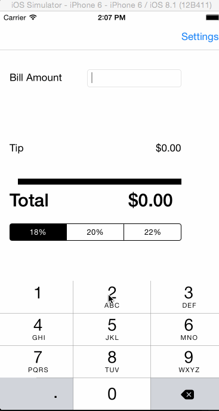
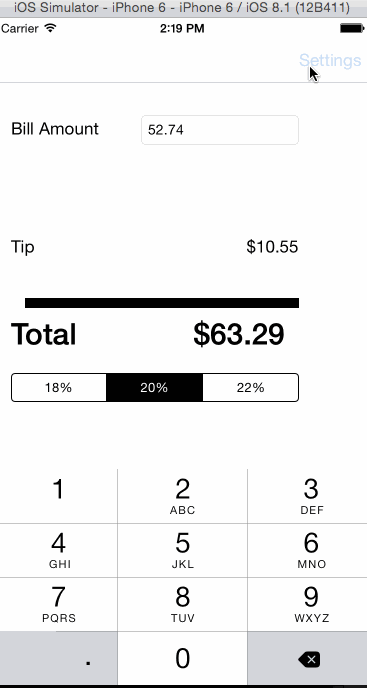
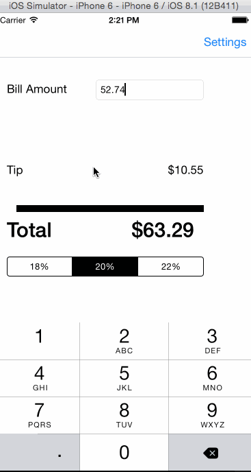
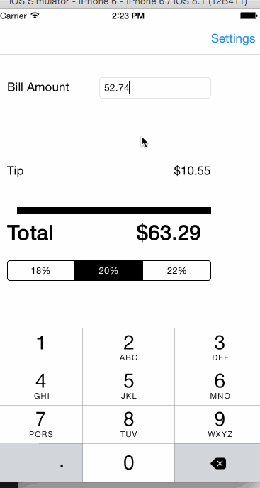
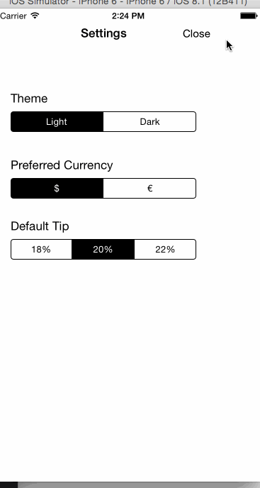
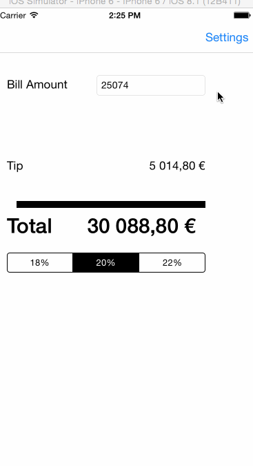

# swift-tips
A simple Swift tip calculator completed along with the CodePath tutorial.

Time spent: 6-7 hours

Completed user stories:

 * [x] Required: Completed basic tip calculator as described in tutorial.
 * [x] Required: Added modal settings view.
 * [x] Optional: Bill amount is remembered across app restarts.
 * [x] Optional: Bill amount is cleared after an extended amount of time (the interval was shortened to 5 seconds for GIF-making purposes)
 * [x] Optional: Locale specific currency and currency thousand separators are used and configured in the settings view.
 * [x] Optional: Light/dark color theme added and configured in settings view.
 
Notes:

Also added a "default tip percentage" option to Settings. Refactored the video tutorial code to use `NSNumberFormatter` to format currency.
# Walkthrough of all user stories:
### Basic tip calculator

### Settings view

### Saving bill total 

### Clearing bill total after interval (shortened to 5 seconds)

### Currency locale option

### Light/dark theme option

GIFs created with [LiceCap](http://www.cockos.com/licecap/).
